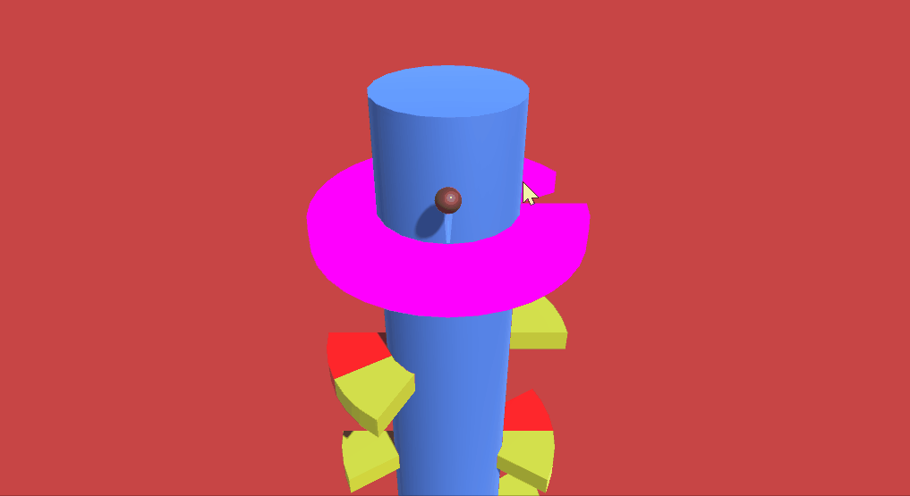
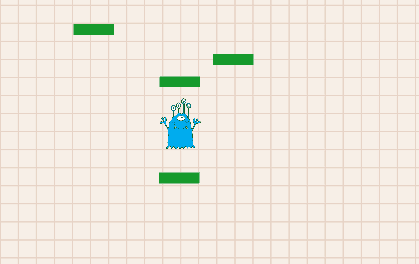
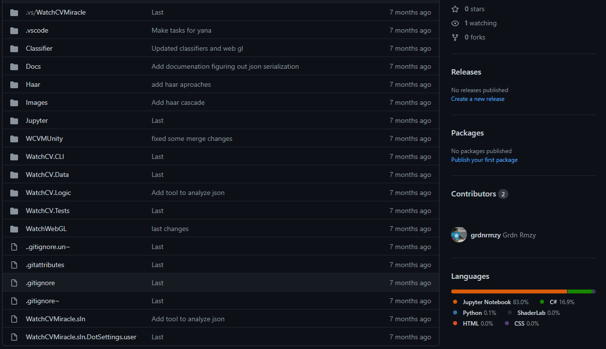
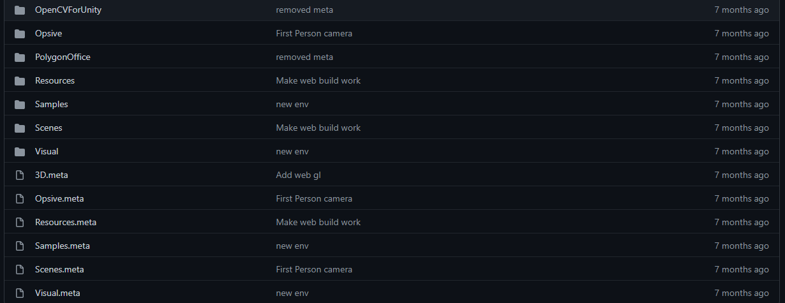
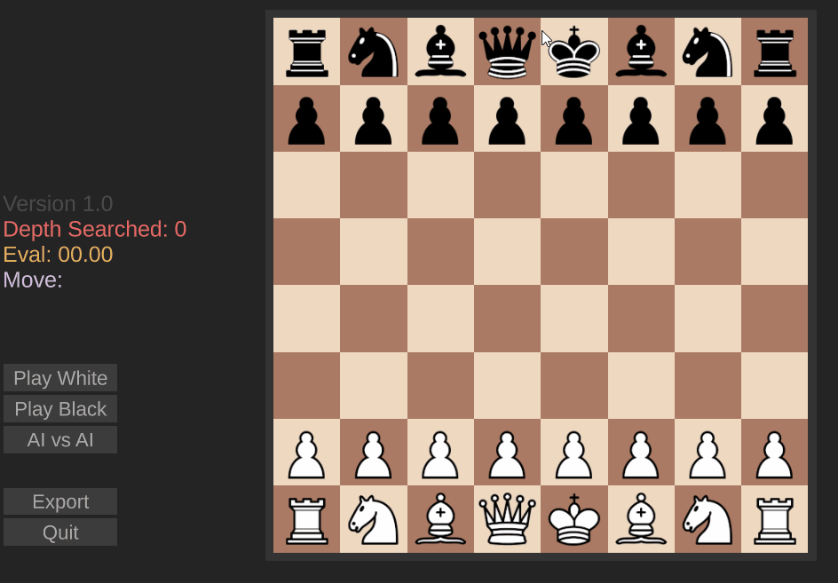
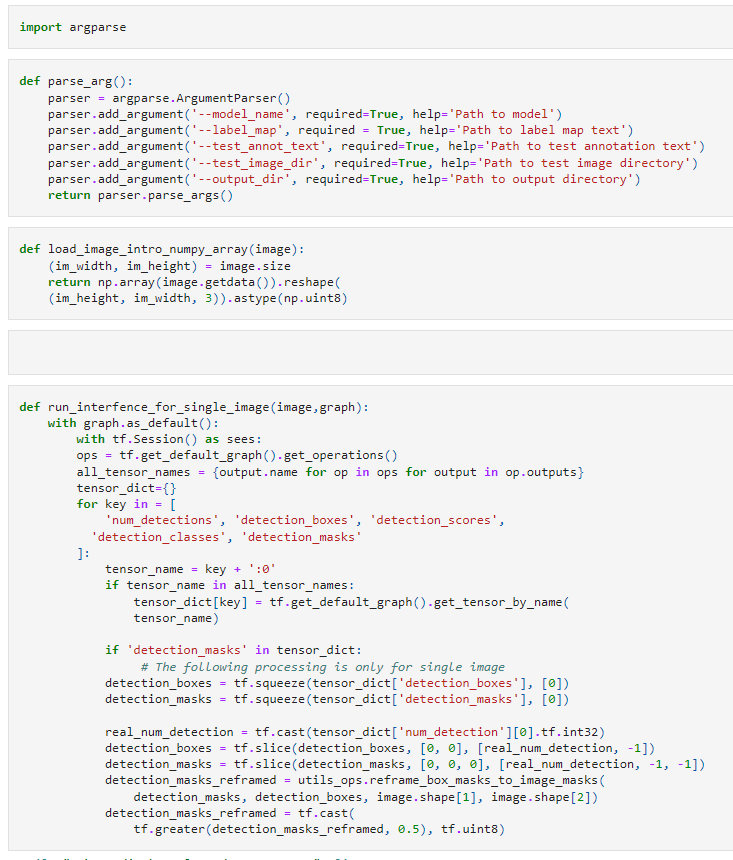

**Helix Jump**

my version of the hyper-casual game

link:[grdnrmzy/MyHelixJump: Helix Jump for portfolio (github.com)](https://github.com/grdnrmzy/MyHelixJump)

---

**Doodle Jump**

Made with level generator.

link: [doodlejump](https://github.com/grdnrmzy/doodlejump)

---

**Flappy Bird**

another mechanic of the famous game. Flappy Bird was created todayanother mechanic of the famous game. Flappy Bird was created today

Link: [Bird](https://github.com/grdnrmzy/FlappyBird)

---

**VR Tours**

Our team was tasked with creating an application for the virtual reality glasses **Oculus Quest 2**. We created the application using Unity. Also, a web build was created for the customer.

link: [ComanG-studio/Pono2VR (github.com)](https://github.com/ComanG-studio/Pono2VR)

---

**neural networks**

* In 2021 I worked with Swiss company "Origyn" as part of AI departnent, worked with Rolex datasets. A visualization in Unity was also created.

This is how the whole project looks like:

Rendering in Unity is also included. This is what the visualization structure looks like:

* Also, neural networks have been used in games. Here's an example of chess using artificial intelligence. The board was created using procedural generation.Also, neural networks have been used in games. Here's an example of chess using artificial intelligence. The board was created using procedural generation.

  
* Neural networks were used to detect objects. For example, cans of Red Bull Energy Drink:

[Jup/3 at main · grdnrmzy/Jup (github.com)](https://github.com/grdnrmzy/Jup/tree/main/3)
